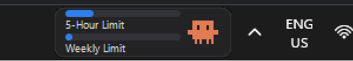
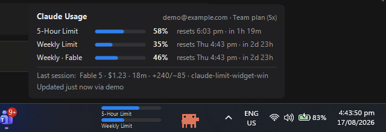
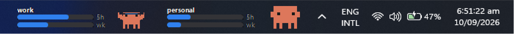

# Claude Limit Widget for Windows 11

A tiny widget embedded in the Windows 11 taskbar (next to the system tray) showing your
Claude **5-hour limit** and **Weekly limit** utilization as progress bars, with an
animated pixel-art Clawd mascot.



Hovering shows every limit window, reset countdowns, and the last session:



## Features

- Lives **inside** the taskbar, left of the tray (TrafficMonitor-style `SetParent` embed)
- One widget per tracked account (see Accounts below)
- Two bars: 5-hour + weekly utilization, blue → orange (≥80%) → red (≥95%)
- Animated Clawd mascot with 4 moods driven by your worst limit
  (from [ayotomcs.me/claude-mascot](https://ayotomcs.me/claude-mascot) SVGs):
  - **&lt;10%** — cheering with confetti (fresh reset)
  - **10–49%** — wander/idle: Clawd walks to random spots across his stage
    (mirrored when heading left), stands around, blinks, glances left/right,
    and occasionally hops — a little desktop pet on quiet days
  - **50–84%** — working out (headband + dumbbells)
  - **≥85%** — waving the finish flag, body tinted orange/red
- Rich hover tooltip: every limit window (5-hour, weekly, weekly-Opus/Sonnet when present)
  with mini bars, percentages and reset countdowns; extra-usage credits; plan/org;
  last session (model, cost, duration, lines changed, workspace); data age and source
- **Transparent background** (tray toggle): drops the dark pill so the bars and mascot
  sit directly on the taskbar surface, as if natively part of it
- Survives `explorer.exe` restarts (auto re-embeds within ~3 s)
- Tray icon menu: accounts (add / rename / hide / remove), refresh, embed/float toggle,
  transparent background, autostart toggle, exit
- Auto-start with Windows (HKCU Run key)

Mascot pipeline: `tools/convert_mascots.py` parses the animation SVGs
(frame groups + transforms) into `ClaudeLimitWidget/sprites.json` (embedded resource),
played by `MascotAnimator.cs`. Re-run it if you swap in new SVGs.

## Accounts (tray → Accounts)

Track as many accounts as you like — **each enabled account gets its own widget**,
stacked leftwards from the tray, with its own poller, its own cache and its own
tooltip.



Three kinds of account can be mixed freely:

- **Claude Code CLI login** — follows whoever is logged into the CLI. The credentials
  file is watched, so `/login` as someone else flips that widget within seconds. This
  is the only kind that receives the statusline feed.
- **Browser sign-in** (recommended for extra accounts) — the widget holds its own OAuth
  token, independent of the CLI, and refreshes it automatically. Works even without
  Claude Code installed.
- **Pasted token** — the box also accepts a raw `sk-ant-…` token, but note that tokens
  from **`claude setup-token` do not work here**: they are inference-only and the usage
  endpoint requires the `user:profile` scope, so such a token returns 403 forever. The
  widget checks this when you add an account and refuses it with an explanation rather
  than adding a widget that never fills in. Use the browser sign-in, which requests the
  right scope.

Tokens live DPAPI-encrypted, one file per account, at
`%APPDATA%\ClaudeLimitWidget\auth-<id>.dat`.

Per account you can rename it (the name is what appears on its widget), hide its
widget without forgetting the account, re-authenticate, or remove it. With a single
account the widget keeps the original label layout; from two upwards each shows its
name with short `5h` / `wk` tags so the pills are told apart at a glance. Each widget
is ~208px wide, so budget taskbar space accordingly.

The tooltip header and tray menu always show which account (email · plan · org) a
widget is following, fetched from that token's own profile.

## How it gets data

| Source | How | When it updates |
|---|---|---|
| **Statusline bridge** (documented) | `ClaudeLimitWidget.exe --statusline` is registered as the Claude Code statusline command; Claude Code pipes it JSON including `rate_limits`, which it saves to `%LOCALAPPDATA%\ClaudeLimitWidget\usage.json` for the widget (and prints `Model \| 5h X% \| wk Y%` as your statusline) | While you use Claude Code interactively |
| **OAuth usage endpoint** (unofficial) | Polls `api.anthropic.com/api/oauth/usage` every 3 min with the token from `~/.claude/.credentials.json` (read-only; never refreshes the token itself) | Whenever a valid token exists |

The freshest value per window wins. After a window's reset time passes, its bar drops to 0.
If data is older than 30 min the bar dims slightly and the tooltip says "stale".

## Build

```
dotnet publish ClaudeLimitWidget -c Release -o publish
```

Requires .NET 8 SDK; the exe runs on the preinstalled .NET 8 Desktop Runtime.

## Run

- `ClaudeLimitWidget.exe` — normal mode
- `ClaudeLimitWidget.exe --demo` — animated fake data for testing the UI
- `ClaudeLimitWidget.exe --statusline` — statusline bridge mode (used by Claude Code, not you)

## Files

- Config: `%APPDATA%\ClaudeLimitWidget\config.json`
- Data + log: `%LOCALAPPDATA%\ClaudeLimitWidget\usage.json`, `cache-<account>.json`,
  `widget.log`

Each `cache-<account>.json` holds that account's last figures so a reboot shows the
previous reading (marked stale) instead of an empty bar. It stores no token. Cached
figures are tied to the account they were fetched for, so if a slot changes hands —
you `/login` as someone else, or re-authenticate a widget to another account — they
are discarded rather than shown under the new name.

## Notes

- **After a reboot the CLI access token is often expired** (it lives ~8 h, and Claude
  Code renews it only when it next runs). Until then the widget cannot poll, so it
  shows the cached figures plus a note in the tooltip; running `claude` once renews
  the token and the widget updates within seconds. A window that has never been
  fetched renders as dim dashes rather than a misleading 0%.
- Must run non-elevated (Windows blocks parenting into explorer's taskbar across integrity levels).
- If embedding ever breaks after a Windows update, right-click the tray icon and untick
  "Embed in taskbar" to use the floating fallback at the same spot.
- The OAuth usage endpoint is undocumented and may change; the statusline source is the
  officially documented path.
- Both `oauth/usage` and `oauth/profile` require the **`user:profile`** scope. A
  credential without it (notably `claude setup-token` output) gets HTTP 403 on every
  poll; the tooltip says so rather than showing an unexplained empty bar.
- Rate limits are per token. If polling returns HTTP 429 the widget honours the
  `Retry-After` header and stops polling until it expires, instead of re-tripping the
  limit every few minutes.

## Security & privacy

- **Your tokens stay on your machine.** Each signed-in account's token pair is stored
  DPAPI-encrypted (`CurrentUser` scope) at `%APPDATA%\ClaudeLimitWidget\auth-<id>.dat` — it can't
  be read by another user or on another machine. In CLI mode the widget only *reads* the
  token Claude Code already stores; it never copies or relocates it.
- **Tokens are only ever sent to `api.anthropic.com` over HTTPS** (the usage/profile endpoints).
  They are never logged, never written in plaintext, and never sent anywhere else.
- **Nothing personal is committed to this repo** — account details, usage numbers, and tokens
  all live under `%APPDATA%`/`%LOCALAPPDATA%` and are covered by `.gitignore`.
- **Unofficial endpoints.** `api.anthropic.com/api/oauth/{usage,profile}` and the token-refresh
  endpoint are undocumented and used with Claude Code's public OAuth client ID, the same way
  community tools do. They may change or stop working without notice, and this usage is a gray
  area under Anthropic's terms — use on your own account, at your own discretion. The statusline
  source is the only officially documented path.

## License

[MIT](LICENSE) © Adrian Dela Cruz. Not affiliated with or endorsed by Anthropic.
